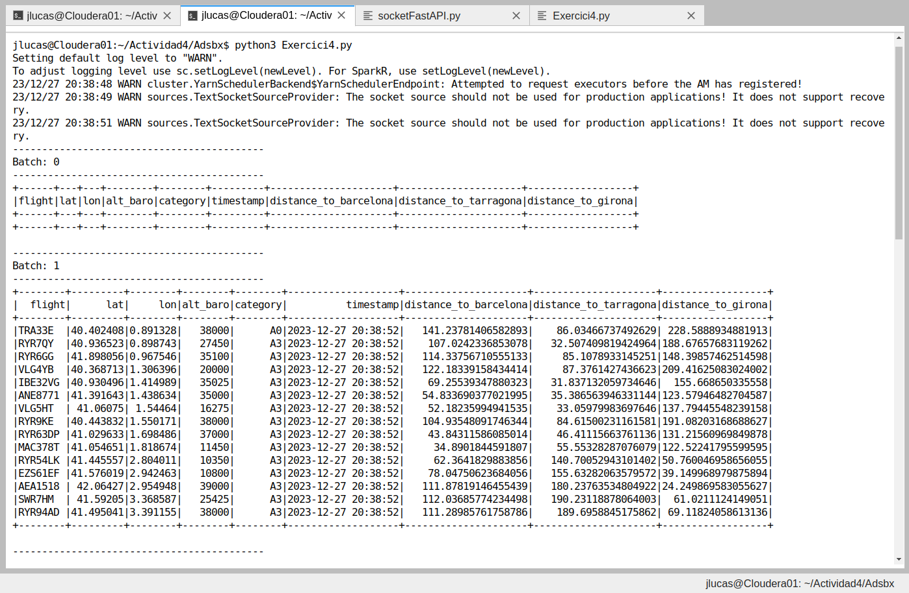

# air-navigation-control-spark
Control the air navigation with the ADS-B Exchange API using Spark Structured Streaming and pyspark.

This code have been deployed on Cloudera with Spark Structured Streaming and the pyspark library.

